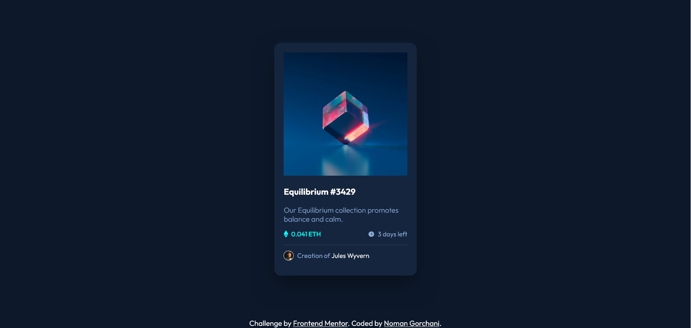

# Frontend Mentor - NFT preview card component solution

This is a solution to the [NFT preview card component challenge on Frontend Mentor](https://www.frontendmentor.io/challenges/nft-preview-card-component-SbdUL_w0U).

## Table of contents

- [Overview](#overview)
  - [The challenge](#the-challenge)
  - [Screenshot](#screenshot)
  - [Links](#links)
- [My process](#my-process)
  - [Built with](#built-with)
  - [What I learned](#what-i-learned)
  - [Continued development](#continued-development)
- [Author](#author)


## Overview

### The challenge

Users should be able to:

- View the optimal layout depending on their device's screen size
- See hover states for interactive elements

### Screenshot




### Links

- Live Site URL: [the link](https://nomanalibaloch.github.io/NFT-preview-card-component/)

## My process

### Built with

- Semantic HTML5 markup
- CSS custom properties
- Flexbox


### What I learned

I had to apply the concepts that I already know, get used to how designing works in css.


```html
<h1>Some HTML code I'm proud of</h1>
```
```css
.author{
    display: flex;
    align-items: center;
    gap:0.5em;
    border-top: 1px solid hsl(215, 32%, 27%);
}
.author p{
    color:hsl(215, 51%, 70%);
    font-size: 1rem;
}
.card .info{
    color:hsl(215, 51%, 70%);
    font-weight: 300;
    margin-bottom: 0;
}
.eth-image p{
    color:hsl(178, 100%, 50%);
    font-weight: 500;
}
```


### Continued development

I will keep building front-ent mentor projects 1 by 1 and as things get tougher I look forward to that, this project felt way too easy


## Author

- Frontend Mentor - [@nomanalibaloch](https://www.frontendmentor.io/profile/nomanalibaloch)


